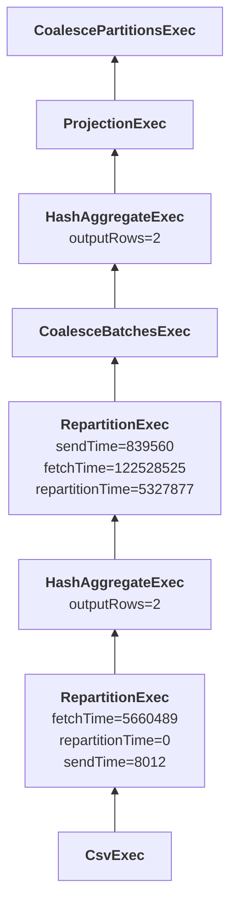

# DataFusion Explain output transformer to Mermaid format

This script transforms DataFusion Explain Analyze output to Mermaid readable text format for simple graph generation.

## Sample input

```
CoalescePartitionsExec, metrics=[]
   ProjectionExec: expr=[SUM(table.x)@1 as SUM(x)], metrics=[]
     HashAggregateExec: mode=FinalPartitioned, gby=[b@0 as b], aggr=[SUM(x)], metrics=[outputRows=2]
       CoalesceBatchesExec: target_batch_size=4096, metrics=[]
         RepartitionExec: partitioning=Hash([Column { name: "b", index: 0 }], 16), metrics=[sendTime=839560, fetchTime=122528525, repartitionTime=5327877]
           HashAggregateExec: mode=Partial, gby=[b@1 as b], aggr=[SUM(x)], metrics=[outputRows=2]
             RepartitionExec: partitioning=RoundRobinBatch(16), metrics=[fetchTime=5660489, repartitionTime=0, sendTime=8012]
               CsvExec: file_groups={1 group: [[/tmp/table.csv]]}, has_header=false, metrics=[]
```

## Sample output

```text
graph BT

0[<b>CoalescePartitionsExec</b>
]
1[<b>ProjectionExec</b>
] --> 0
2[<b>HashAggregateExec</b>
outputRows=2] --> 1
3[<b>CoalesceBatchesExec</b>
] --> 2
4[<b>RepartitionExec</b>
sendTime=839560\n fetchTime=122528525\n repartitionTime=5327877] --> 3
5[<b>HashAggregateExec</b>
outputRows=2] --> 4
6[<b>RepartitionExec</b>
fetchTime=5660489\n repartitionTime=0\n sendTime=8012] --> 5
7[<b>CsvExec</b>
] --> 6
```

## Sample diagram

